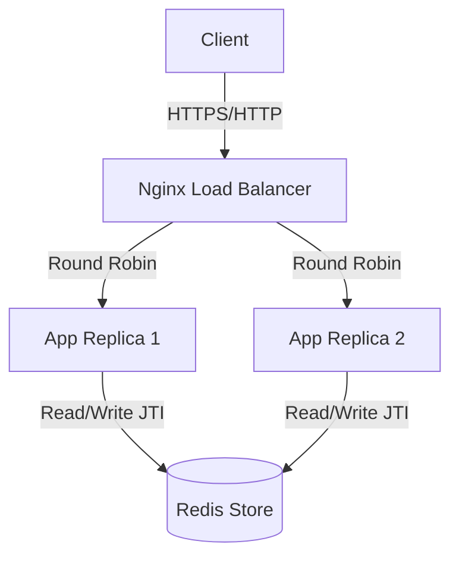

# BP-DevOps Technical Assessment

This project is a robust, containerized microservice solution designed to meet the rigorous standards of a DevOps technical assessment. It demonstrates a full CI/CD lifecycle, Infrastructure as Code (IaC), secure API design, and scalable architecture using modern technologies.

## 🚀 Project Overview

The core of the project is a Node.js/Express microservice that exposes a secured REST endpoint (`/DevOps`). The architecture is designed for high availability and security, featuring:

*   **Load Balancing**: Nginx distributes traffic across multiple application replicas.
*   **Scalability**: Docker Compose orchestrates the services (App, Nginx, Redis).
*   **Security**:
    *   **API Key Authentication**: Validates authorized clients.
    *   **JWT Validation**: Ensures secure, stateless authentication.
    *   **Replay Attack Protection**: Uses **Redis** to track used JWT IDs (JTI), preventing token reuse across distributed replicas.
*   **Infrastructure as Code**: Terraform provisions resources on Google Cloud Platform (GCP).
*   **CI/CD**: GitHub Actions automates testing, building, provisioning, and deployment.

## 🏗 Architecture



## 🛠 Technologies

*   **Language**: TypeScript, Node.js, Express
*   **Containerization**: Docker, Docker Compose
*   **Database/Cache**: Redis (Alpine)
*   **Web Server**: Nginx
*   **Infrastructure**: Terraform, Google Cloud Platform (Compute Engine)
*   **CI/CD**: GitHub Actions
*   **Testing**: Jest, Supertest
*   **Linting**: ESLint

## ⚙️ Setup & Installation

### Prerequisites
*   Docker & Docker Compose
*   Node.js (v18+) & npm

### Local Development

1.  **Clone the repository**
    ```bash
    git clone <repository-url>
    cd <repository-name>
    ```

2.  **Install Dependencies**
    ```bash
    npm install
    ```

3.  **Environment Configuration**
    Create a `.env` file in the root directory:
    ```env
    PORT=3000
    API_KEY=2f5ae96c-b558-4c7b-a590-a501ae1c3f6c
    JWT_SECRET=devops-secret-key
    REDIS_HOST=redis
    ```

4.  **Run with Docker Compose**
    This will start Nginx, Redis, and 2 Replicas of the App.
    ```bash
    docker compose up --build
    ```
    The API will be available at `http://localhost:8080`.

## 🔑 Token Generation

To interact with the API, you need a valid JWT. A utility script is provided to generate unique tokens.

**Generate a single token:**
```bash
npx ts-node scripts/generate_token.ts
```

**Generate a raw token (useful for assigning to variables):**
```bash
export JWT=$(npx ts-node scripts/generate_token.ts --raw)
```

## 📡 API Usage

### Endpoint: `POST /DevOps`

**Headers:**
*   `X-Parse-REST-API-Key`: `2f5ae96c-b558-4c7b-a590-a501ae1c3f6c`
*   `X-JWT-KWY`: `<YOUR_GENERATED_JWT>`
*   `Content-Type`: `application/json`

**Request Body:**
```json
{
    "message": "This is a test",
    "to": "Juan Perez",
    "from": "Rita Asturia",
    "timeToLifeSec": 45
}
```

**Response:**
```json
{
    "message": "Hello Juan Perez your message will be send"
}
```

**Curl Example:**
```bash
curl -X POST \
-H "X-Parse-REST-API-Key: 2f5ae96c-b558-4c7b-a590-a501ae1c3f6c" \
-H "X-JWT-KWY: $JWT" \
-H "Content-Type: application/json" \
-d '{ "message" : "This is a test", "to": "Juan Perez", "from": "Rita Asturia", "timeToLifeSec" : 45 }' \
http://localhost:8080/DevOps
```

## 🔄 CI/CD Pipeline

The project uses GitHub Actions for continuous integration and deployment.

*   **Build & Test Stage**: Runs on **all branches**.
    *   Lints code.
    *   Runs unit tests (Jest).
    *   Builds Docker image.
*   **Provision & Deploy Stage**: Runs **only on `main` branch**.
    *   **Terraform**: Provisions a VM on GCP.
    *   **Deploy**: Pushes Docker image to Docker Hub, SSHs into the VM, and updates the running containers using `docker-compose.prod.yml`.

## ✅ Requirements Checklist

### Core Requirements
- [x] **Microservice Endpoint**: `POST /DevOps` implemented.
- [x] **JSON Payload**: Accepts and returns specified JSON formats.
- [x] **Error Handling**: Returns "ERROR" for non-POST methods.
- [x] **Security**:
    - [x] API Key validation (`X-Parse-REST-API-Key`).
    - [x] JWT validation (`X-JWT-KWY`).
    - [x] **Unique Transaction**: JWT Replay protection implemented via Redis.

### Infrastructure & DevOps
- [x] **Containerization**: Dockerfile and Docker Compose used.
- [x] **Load Balancer**: Nginx configured with 2 application nodes.
- [x] **Infrastructure as Code**: Terraform used for GCP provisioning.
- [x] **Version Control**: Git repository used.

### Pipeline (CI/CD)
- [x] **Dependency Management**: `npm` used.
- [x] **Stages**: Build, Test, Provision, Deploy.
- [x] **Automation**:
    - [x] Automatic execution on push.
    - [x] `main` branch deploys to production.
    - [x] Other branches (e.g., `develop`) run CI but do not deploy.
- [x] **Pipeline as Code**: `.github/workflows/pipeline.yml`.

### Quality & Extras
- [x] **Automatic Testing**: Jest unit tests included.
- [x] **Static Code Analysis**: ESLint configured.
- [x] **Clean Code**: Project structured with controllers, middleware, and routes.
